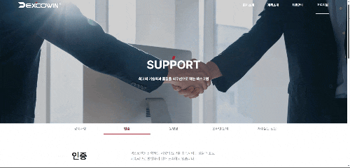
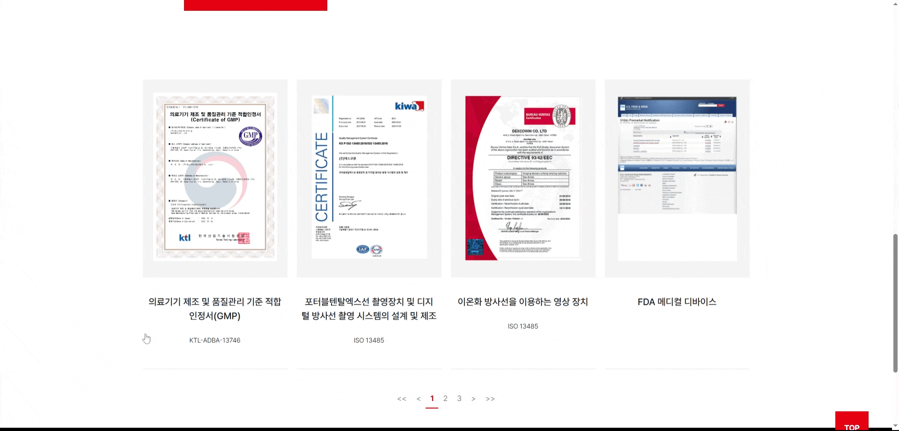

# 📄 과제 제출물: 웹 퍼블리싱 프로젝트

본 프로젝트는 **알지비커뮤니케이션즈** 웹 퍼블리셔 채용 전형을 위해 제작된 과제물입니다. Figma 디자인 시안을 바탕으로 컴포넌트의 재사용성과 사용자 인터랙션을 고려하여 구현하였습니다.

---

## 1. 프로젝트 개요

- **대상:** Figma 시안 기반 웹 페이지 구현
- **주요 페이지:**
  - 메인 페이지 (`/`) : 7개의 세부 섹션으로 구성된 랜딩 페이지
  - 서포트 페이지 (`/support`) : 인증서(Certificate) 안내 및 상세 정보 페이지
- **개발 환경:** React + Vite
- **선택 사유:** 디자인 시안 내 다양한 인터랙션(캐러셀 등)을 효율적으로 관리하고, Vite의 빠른 빌드 속도를 활용하여 개발 생산성을 높이기 위해 선택했습니다.

---

## 2. 작업 소요 시간 및 프로세스

순수 작업 시간 기준(기술 탐색 시간 제외)이며, 각 단계별로 체계적인 프로세스에 따라 진행하였습니다.

| 단계              | 주요 내용                                        | 소요 시간     |
| :---------------- | :----------------------------------------------- | :------------ |
| **환경 세팅**     | 디자인 분석, Vite 프로젝트 및 스타일 가이드 설정 | 약 1시간      |
| **메인 레이아웃** | 7개 섹션 시맨틱 마크업 및 기본 스타일링          | 약 6시간      |
| **인터랙션 구현** | 메인 페이지 내 섹션 전환 및 효과 적용            | 약 3시간      |
| **서포트 페이지** | Certificate 섹션 및 상세 UI 구현                 | 약 3시간      |
| **데이터 연결**   | 재사용성을 고려한 임시 데이터 바인딩             | 약 1시간      |
| **최종 검수**     | 웹 접근성 가이드 준수 확인 및 최종 마무 리       | 약 2시간      |
| **Total**         |                                                  | **약 16시간** |

---

## 3. 프로젝트 세부 사항

### 01. 메인 페이지 - 캐러셀(Carousel) 전환 효과


Figma에 제시된 3개의 핵심 섹션에 대해 각각의 디자인 특성에 맞는 캐러셀 전환 인터랙션을 적용했습니다.


- **구현 내용:** 외부 라이브러리 의존도를 낮추고 React의 상태 관리를 활용하여 부드러운 슬라이드 효과를 구현했습니다.
- **최적화:** 성능을 고려하여 CSS `transform` 속성을 활용한 애니메이션을 적용했습니다.

### 02. 서포트 페이지 - 강조(확대) 기능 및 Hover 효과



사용자 경험을 높이기 위해 인증서 영역에 시각적인 강조 효과를 부여했습니다.



- **구현 내용:** `hover` 시 강조를 적용하여 주목도를 높였습니다.

---

## 4. 실행 방법

```bash
git clone https://github.com/Bubbley-dev/RGBcom_test.git
cd RGBcom_test

npm install

npm run dev
```

- 서버 실행 후 링크 열기(localhost) : http://localhost:5173/

프로젝트 보안을 위해 디자인 자산이 포함된 소스 코드는 제출 및 당사 검토 후 비공개로 전환됩니다.
